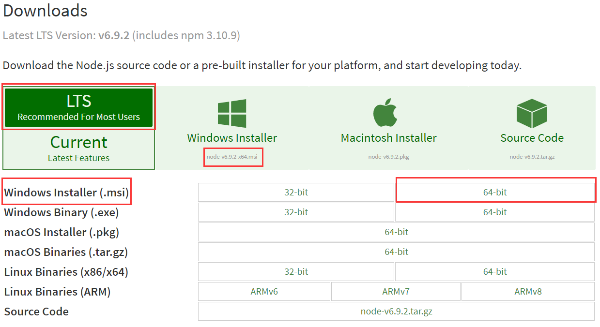
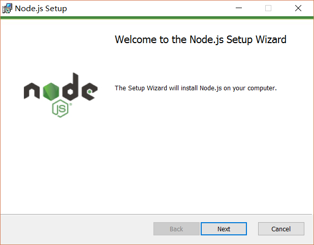
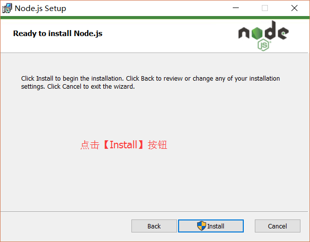
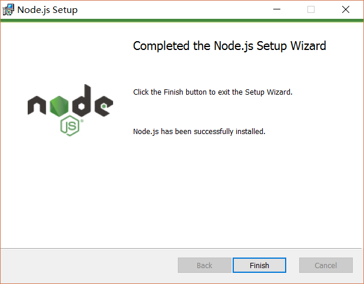
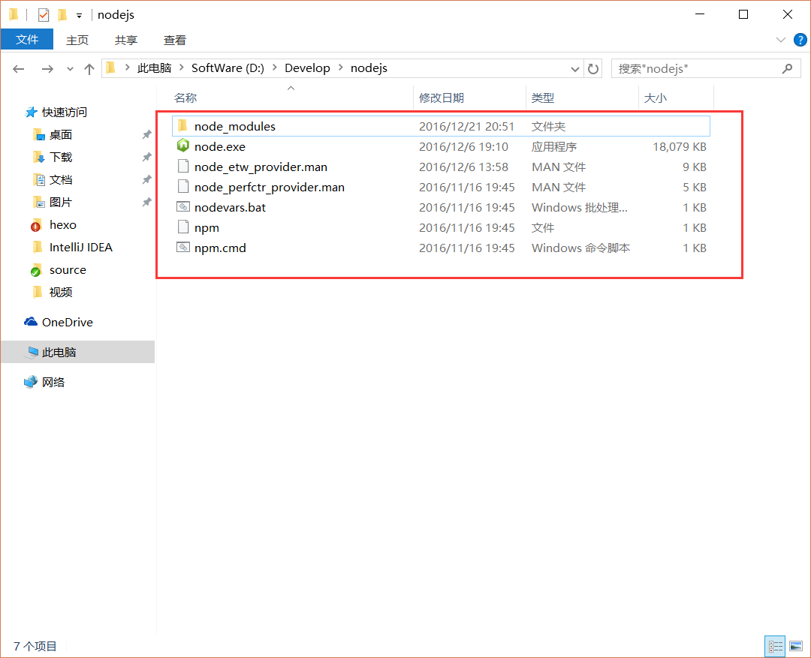
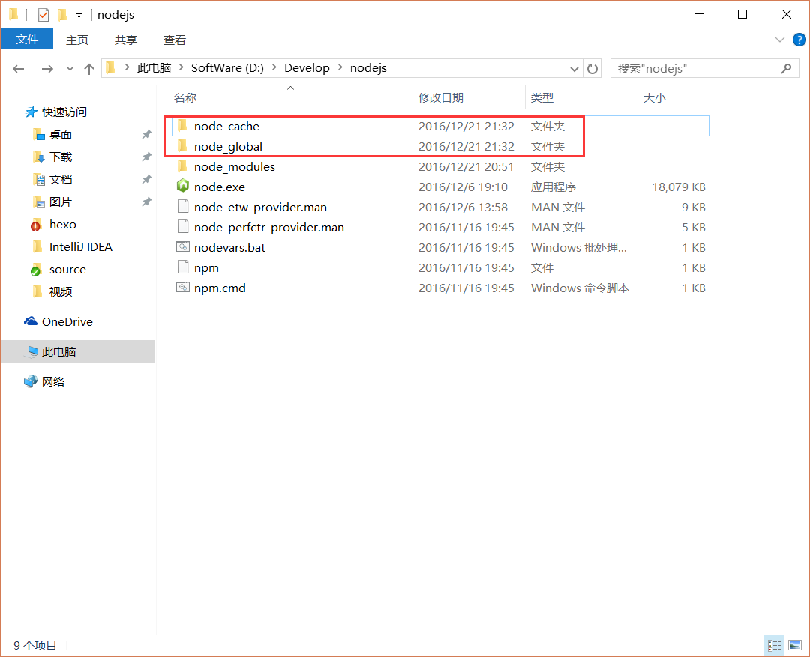
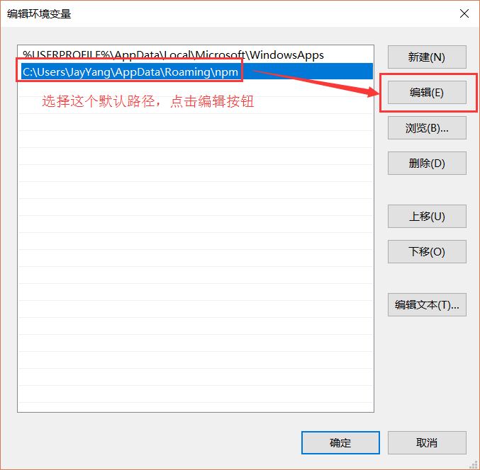
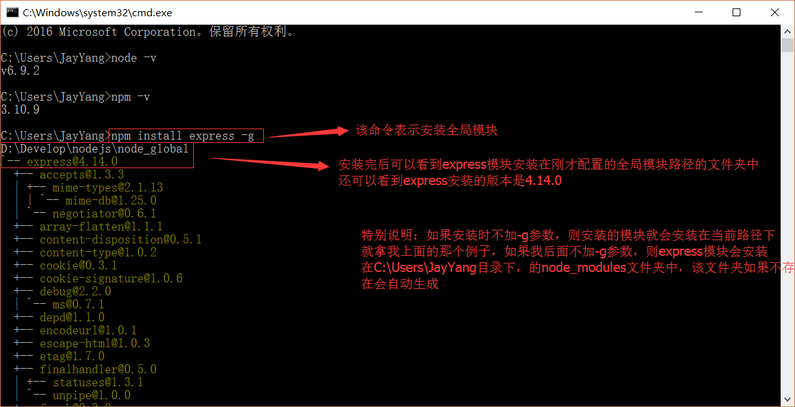

# Node.js安装及环境配置之Windows篇

## Node.js安装及环境配置之Windows篇
### 一、安装环境
1. 本机系统：Windows 10（64位）

### 二、安装Node.js步骤
1. 下载对应你系统的Node.js版本:[https://nodejs.org/en/download/](https://nodejs.org/en/download/)
2. 选安装目录进行安装
3. 环境配置
4. 测试

### 三、前期准备
1. Node.js简介
简单的说 Node.js 就是运行在服务端的 JavaScript。Node.js 是一个基于 Chrome V8 引擎的 JavaScript 运行环境。Node.js 使用了一个事件驱动、非阻塞式 I/O 的模型，使其轻量又高效。Node.js 的包管理器 npm，是全球最大的开源库生态系统。
2. 下载Node.js
打开官网下载链接:[https://nodejs.org/en/download/](https://nodejs.org/en/download/) 我这里下载的是node-v6.9.2-x64.msi,如下图：

### 四、开始安装
下载完成后，双击“node-v6.9.2-x64.msi”，开始安装Node.js

点击【Next】按钮

勾选复选框，点击【Next】按钮

修改好目录后，点击【Next】按钮

安装完后点击【Finish】按钮完成安装

至此Node.js已经安装完成，可以先进行下简单的测试安装是否成功了，后面还要进行环境配置
在键盘按下【win+R】键，输入cmd，然后回车，打开cmd窗口

安装完后的目录如下图所示：

此处说明下：新版的Node.js已自带npm，安装Node.js时会一起安装，npm的作用就是对Node.js依赖的包进行管理，也可以理解为用来安装/卸载Node.js需要装的东西

### 五、环境配置
说明：这里的环境配置主要配置的是npm安装的全局模块所在的路径，以及缓存cache的路径，之所以要配置，是因为以后在执行类似：npm install express [-g] （后面的可选参数-g，g代表global全局安装的意思）的安装语句时，会将安装的模块安装到【C:\Users\用户名\AppData\Roaming\npm】路径中，占C盘空间。
例如：我希望将全模块所在路径和缓存路径放在我node.js安装的文件夹中，则在我安装的文件夹【D:\Develop\nodejs】下创建两个文件夹【node_global】及【node_cache】如下图：

创建完两个空文件夹之后，打开cmd命令窗口，输入
npm config set prefix "D:\Develop\nodejs\node_global"
npm config set cache "D:\Develop\nodejs\node_cache"

进入环境变量对话框，在【系统变量】下新建【NODE_PATH】，输入【D:\Develop\nodejs\node_global\node_modules】，将【用户变量】下的【Path】修改为【D:\Develop\nodejs\node_global】

接下来设置环境变量，关闭cmd窗口，“我的电脑”-右键-“属性”-“高级系统设置”-“高级”-“环境变量”

### 六、测试
配置完后，安装个module测试下，我们就安装最常用的express模块，打开cmd窗口，
输入如下命令进行模块的全局安装：
npm install express -g     # -g是全局安装的意思

